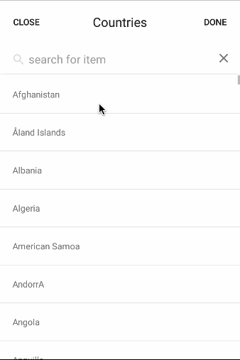
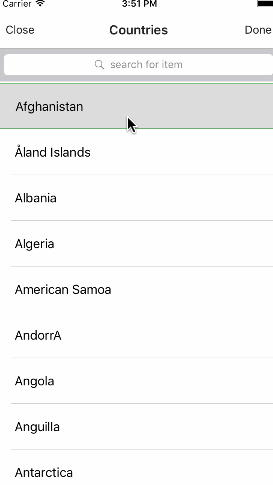

# nativeScript-filter-select
# NativeScript filter select 

A NativeScript plugin to provide an listview widget to select AND filter items.


## Installation

##### NativeScript 2.x
- `tns plugin add nativescript-filter-select`


*Be sure to run a new build after adding plugins to avoid any issues
## Vanilla NativeScript

 <span style="color:red">IMPORTANT: </span>*Make sure you include `xmlns:FS="nativescript-filter-select"` on the Page element*

### XML
```XML
<Page xmlns:Card="nativescript-filterselect">
   <StackLayout>     
     <FS:FilterSelect 
     items="{{ countries }}"
     hint="Please select some countries" 
     modal_title="Countries" search_param="name" 
     primary_key="code" 
     onSelect="{{ onSelect }}"
     />
   </StackLayout>
</Page>
```

## Attributes
see demo for more info 


## Sample Screenshots

#### Android and ios

Sample 1 |  Sample 2
-------- | ---------
 | 

### CSS
```CSS
FilterSelect{
    border-style: solid;
    padding: 3;
    border-width: 1;
    border-color: #ccc;
    border-radius: 5; 
}
.btn-filter-select{
   vertical-align: middle;
   align-content: center;
   margin: 0;
   padding: 1;
}
.filter-select-tag{
   
    margin-left: 8;
    border-width: 1;
    border-color: #ccc;
    border-radius: 5; 
    padding: 6;
    
}
.felter-select-list label{
  padding: 20;
}

.felter-select-list{
  margin: 2;
}
.filter-select-hint{
vertical-align: middle;
text-align: center;
margin-top: 8;
}

.filter-select-selected{
    border-width: 1;
    border-color: green;
}
// below core-theme styles if you dont have them just make your own 
.filter-select-tags-holder{
}

.filter-select{
   
}


.base-filter-select{
}

.btn-filter-select{
}

.base-filter-select{

}

.action-bar-title{

}

.text-center{

}
.text-left{

}
.text-right{

}

.action-bar{

}

.p-10{

}

.hr-light{

}

.btn{

} 

.btn-primary{
    
}
```


